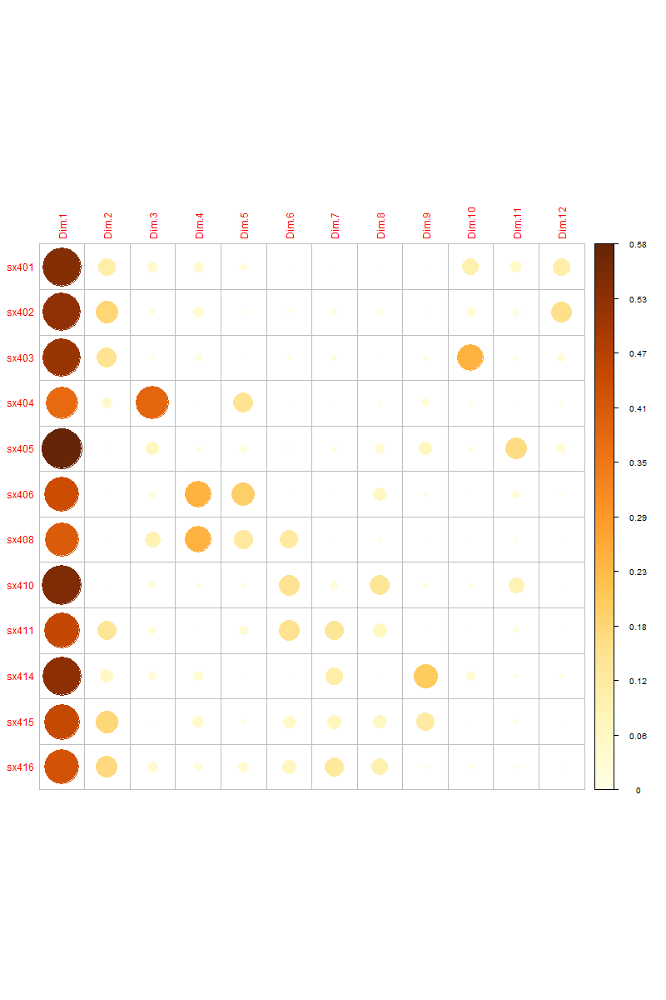
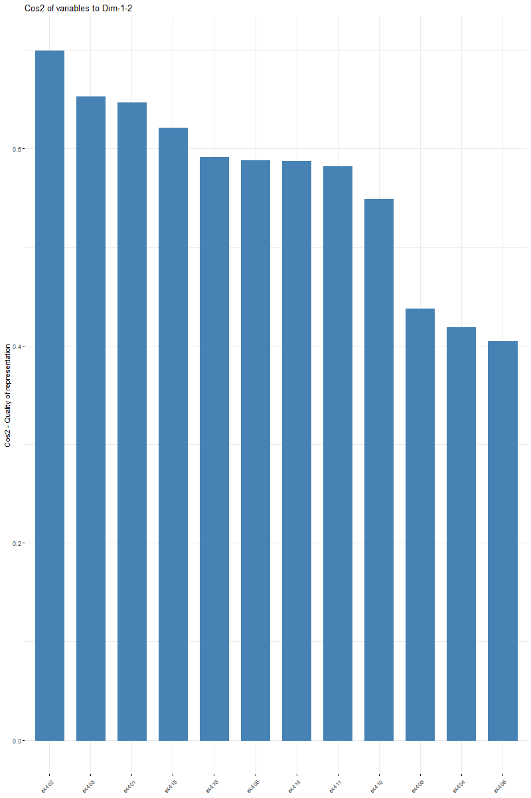
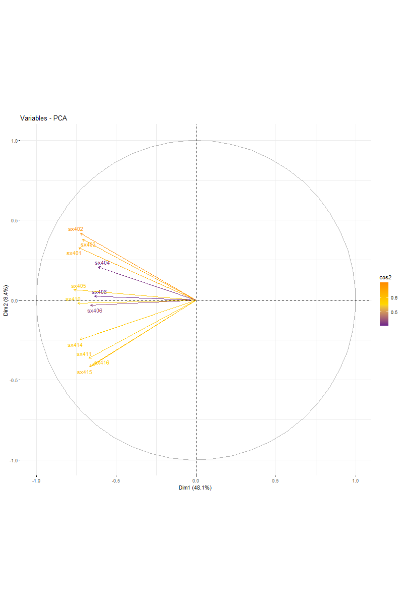
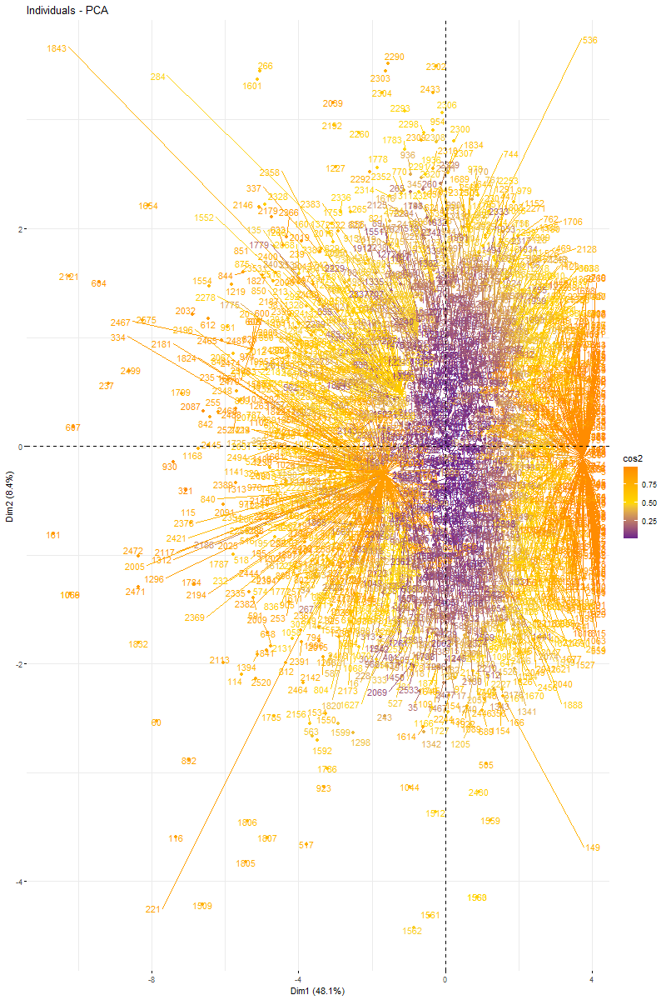
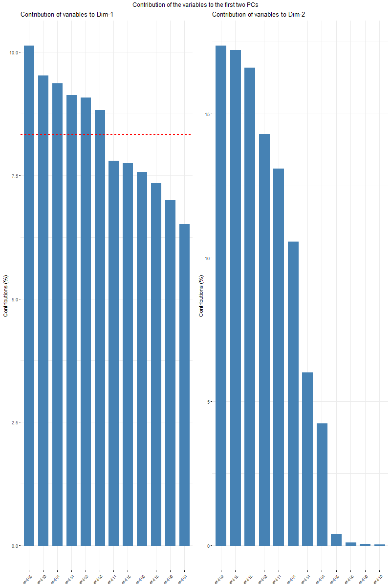
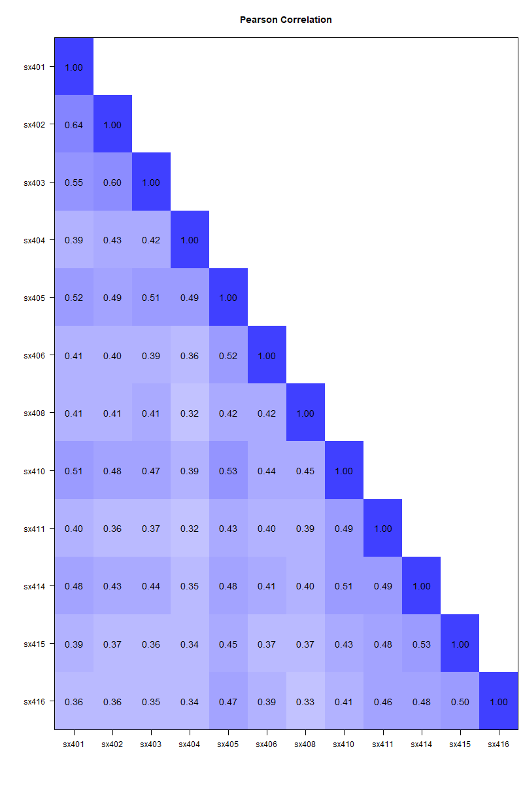
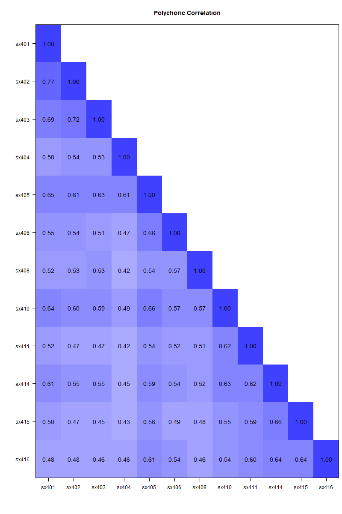
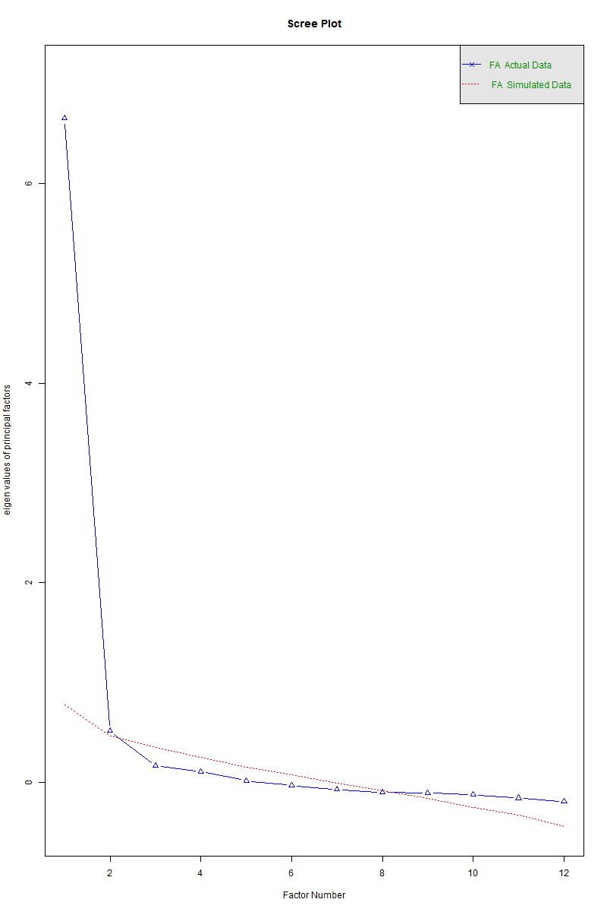

# Introduction

This project was done to perform a principal component analysis and identify a suitable model for further analysis. The dataset was obtained from the public access *demographic health survey*. 


# Background 

One of the primary uses of PCA is **dimensionality reduction**. This analysis helps in determining the number of principal components to retain while discarding the rest. It does this by visualizing the amount of variance explained by each principal component. Typically, one aims to retain enough components to capture a significant portion (often around 70-90%) of the total variance. 

In our dataset we have *12 dimensions* that are measured on a Likert scale of 1 to 4. By the end of the analysis we will identify principal components that explain the majority of variance. 

# Analysis 

Setting working directory and importing the data. 
``` R 
setwd("C:/Users/USER/Desktop/Thesis Data")
library(haven)
fptest <- read_dta(file = "ETFP81FLSR.DTA")

```
Installing and calling all the neccessary packages and libraries. 
``` R
library(summarytools)
library(ggplot2)
library(gridExtra)
library(carData)
library(factoextra)
library(car)
library(corrplot)
```
Creating our outcome variable with 12 dimensions. The *attach* function helps in avoiding the need to reference the dataframe for each variable. 
``` R
attach(fptest) 
overall_client_satisfaction <- data.frame(sx401, sx402, sx403,
                                          sx404, sx405, sx406, sx408,
                                          sx410, sx411, sx414, sx415, sx416)
overall_client_satisfaction[overall_client_satisfaction == 8] <- NA
overall_client_satisfaction[overall_client_satisfaction == 9] <- NA
overall_client_satisfaction <- na.omit(overall_client_satisfaction)
```

``` R
descr(overall_client_satisfaction)
summary(overall_client_satisfaction)
```
### Performing PCA:

The following block of code performs the PCA on the overall_client_satisfaction dataset. The *scale = TRUE* argument means that the data is standardized (mean of 0 and standard deviation of 1 for each variable) before performing PCA. This is important when the variables are on different scales. 

From this analysis we get the proportion of variance explained by each component and the cumulative variance explained.

### Eigenvalues and Visualization:
 
The get_eigenvalue function from the package factoextra is used to assign eigenvalues for each variable. The corrplot package is used to visualize the matrix of squared cosines (not actual correlations in this context), giving insights into how well each variable is represented by the components.

### Further Visualizations:

*fviz_cos2* visualizes the quality of representation (cos2) of the variables on the first two principal components.
The final *fviz_pca_var* call creates a detailed visualization of the variables on the PCA plot, colored by their cos2 values, with a gradient indicating the quality of their representation on the principal components. 

The *repel = TRUE* argument helps in avoiding text overlapping by adjusting the position of text labels.

``` R
res_pca <- prcomp(overall_client_satisfaction, scale = TRUE)
print(res_pca)
summary(res_pca)
eig_val <- get_eigenvalue(res_pca)
eig_val
fviz_eig(res_pca, col.var = "blue")
var <- get_pca_var(res_pca)
var
head(var$cos2)
corrplot(var$cos2, is.corr = FALSE)
fviz_cos2(res_pca, choice = "var", axes = 1:2)
fviz_pca_var(res_pca,
  col.var = "cos2", # Color by the quality of representation
  gradient.cols = c("darkorchid4", "gold", "darkorange"),
  repel = TRUE
)
```
  

The contribution of individual variables the principal components can also be visualized in the manner below. 

``` R
ind <- get_pca_ind(res_pca)
ind
fviz_pca_ind(res_pca,
  col.ind = "cos2", # Color by the quality of representation
  gradient.cols = c("darkorchid4", "gold", "darkorange"),
  repel = TRUE
)
```

```R
``` R
# Contributions of variables to PC1
a <- fviz_contrib(res_pca, choice = "var", axes = 1)
# Contributions of variables to PC2
b <- fviz_contrib(res_pca, choice = "var", axes = 2)
grid.arrange(a, b, ncol = 2,
             top = "Contribution of the variables to the first two PCs")

```


``` R
#data summary
install.packages("psych")
library(psych)
des2 = describe(overall_client_satisfaction)
print(des2)
knitr::kable(des2[,c("min", "max", "mean", "median", "skew", "kurtosis")],
             main = "Data Summary")
```

The *cor* function computes the Pearson correlation coefficients for every pair of variables (columns) in *features2*. Pearson correlation measures the linear relationship between two continuous variables, with a value range of -1 to 1. A correlation of -1 indicates a perfect negative linear relationship, 0 indicates no linear relationship, and 1 indicates a perfect positive linear relationship.
```R
## Pearson Correlation
features2 <- overall_client_satisfaction[1:12]
pear_cor2 <- cor(features2)
cor.plot(pear_cor2, numbers = TRUE, upper = FALSE, main = "Pearson Correlation",
         show.legend = FALSE)
```


The *polychoric* function is used to calculate the polychoric correlation matrix for the variables in features2, which contains ordinal variables of Likert scale. 

``` R
## Polychoric correlation
poly_cor2 <- polychoric(features2)
rho <- poly_cor2$rho
save(rho, file = "polychoric")
### Thresholds/Scaling results
poly_cor2$tau
cor.plot(poly_cor2$rho, numbers = TRUE, upper = FALSE,
         main = "Polychoric Correlation", show.legend = FALSE)
load("polychoric")
```


The *scree plot* is a graphical representation commonly used in Principal Component Analysis (PCA). It displays the eigenvalues (variances) of each principal component in descending order against the component number. 
``` R
# Scree plot
fa.parallel(rho, fm = "pa", fa = "fa", main = "Scree Plot")
```


From the scree plot we can see that the first two principal components explain the majority (56.5%) of the variance. 

Finally, we will transforms the original data into the new coordinate system defined by the retained principal components.

```R
mat_overall <- overall_client_satisfaction[, 1:12]
cor(mat_overall)
pca_overall <- prcomp(mat_overall)
mat_overall_2 <- predict(pca_overall, newdata = mat_overall)
cor(mat_overall_2)
with_pc_overall <- cbind(mat_overall, mat_overall_2[, 1:4])
View(with_pc_overall)
descr(with_pc_overall)
```

# Conclusion

Principal Component Analysis (PCA) is a widely used technique for reducing the dimensionality of data while preserving most of the variability present in the original dataset. It achieves this by transforming the original variables into a new set of orthogonal variables, known as principal components (PCs), which are linear combinations of the original variables.

Here's what we did in this analysis

**Standardization of Data:** Before performing PCA, it's typical to standardize the data by centering each variable around its mean and scaling it to have unit variance. This step ensures that variables with larger scales do not disproportionately influence the PCA results.

**Calculation of Covariance Matrix:** PCA calculates the covariance matrix of the standardized data. This matrix provides information about the relationships (covariances) between pairs of variables.

**Eigenvalue Decomposition:** PCA then performs eigenvalue decomposition on the covariance matrix. This process results in a set of eigenvalues and corresponding eigenvectors. The eigenvalues represent the variance explained by each principal component, while the eigenvectors represent the directions (or axes) of maximum variance in the data.

**Selection of Principal Components:** PCA sorts the eigenvalues in descending order, indicating the amount of variance explained by each principal component. Typically, only the principal components with the highest eigenvalues are retained, as they capture the most variability in the data. The number of principal components to retain is often determined based on a scree plot or by selecting components that explain a certain percentage of the total variance.

**Transformation of Data:** Finally, PCA transforms the original data into the new coordinate system defined by the retained principal components. This transformation involves projecting the data onto the principal components, effectively creating a new set of variables that are linear combinations of the original variables.


